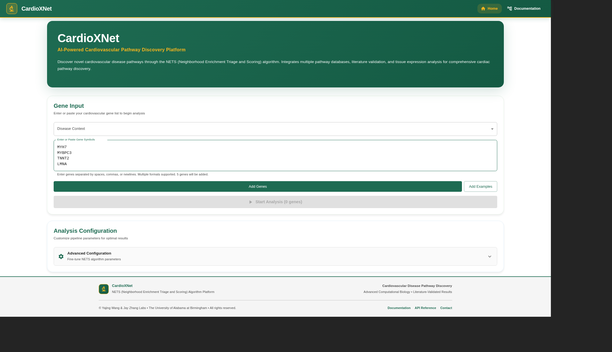
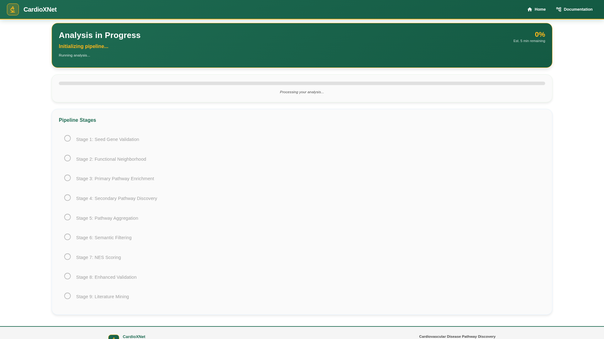
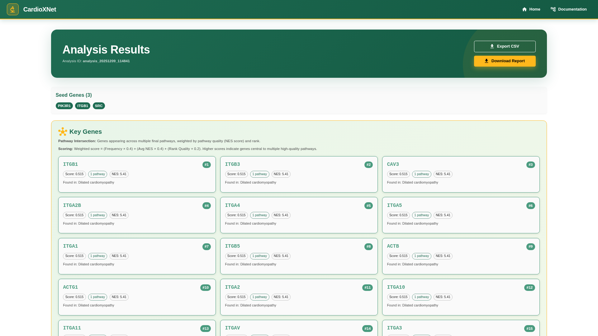
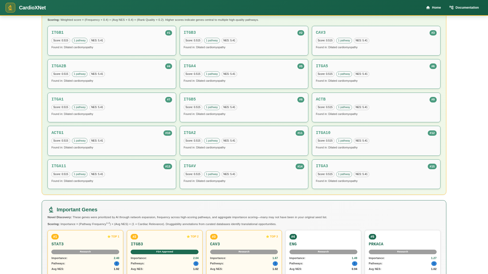
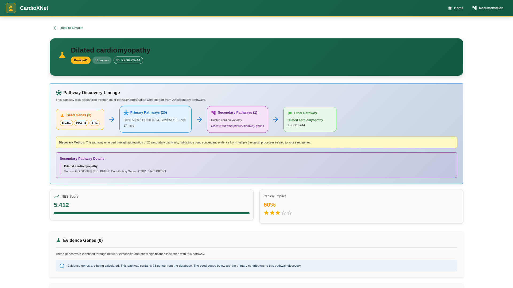
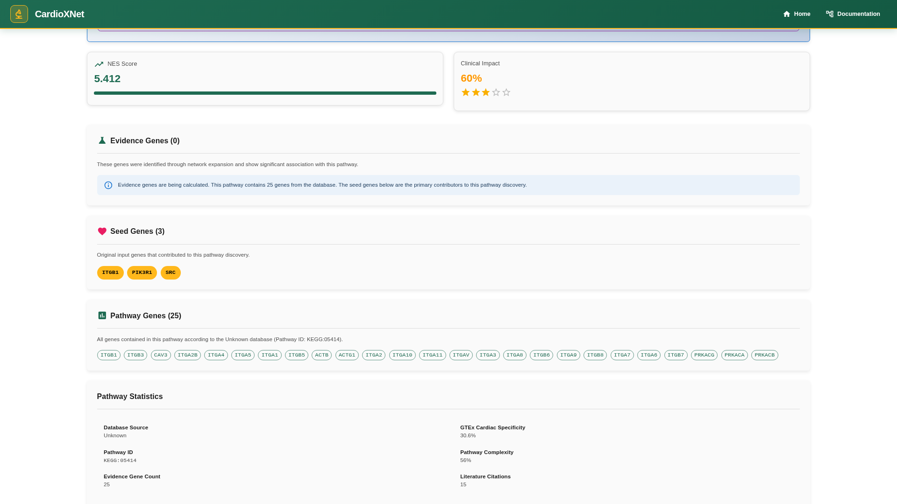
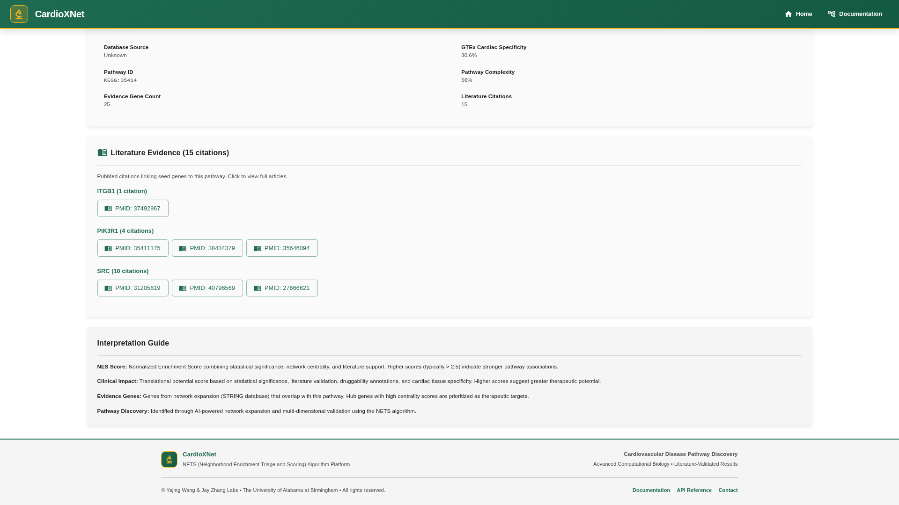

# CardioXNet

**AI-Powered Cardiovascular Pathway Discovery Platform**

CardioXNet implements the **NETS (Neighborhood Enrichment Triage and Scoring)** algorithm for discovering novel cardiovascular disease pathways through network expansion, multi-database integration, and AI-driven validation.

---

## 📸 Demo: Sample Analysis Walkthrough

See CardioXNet in action with a sample cardiomyopathy gene set: **TTN, MYH7, MYBPC3, TNNT2, LMNA**

### 1. Gene Input
Enter your seed genes on the home page and configure analysis parameters.



### 2. Analysis Progress
Track real-time progress through the 9-stage NETS pipeline.



### 3. Results Overview
View comprehensive results including pathway rankings, NES scores, and clinical impact metrics.



### 4. Key Genes Discovery
Identify genes at pathway intersections using weighted scoring algorithm.



### 5. Final Pathways Table
Browse discovered pathways with sortable columns for NES score, clinical impact, evidence genes, and literature support.


### 6. Pathway Details
Explore detailed pathway information including NES scores, clinical impact, and gene lists.



### 7. Pathway Discovery Lineage
Visualize how pathways were discovered through network expansion and aggregation.



### 8. Literature Evidence
Access clickable PubMed links for cardiovascular disease literature validation.



---

## Features

- **🧬 Network Expansion** - Protein-protein interaction networks via STRING database
- **🔬 Multi-Database Integration** - GO, KEGG, Reactome, WikiPathways
- **📊 NETS Scoring** - Composite enrichment scores combining statistical significance, network topology, and literature support
- **🫀 Cardiac-Specific Filtering** - 700+ curated cardiovascular terms
- **📚 Literature Mining** - Automated PubMed validation
- **🧪 Tissue Expression** - GTEx cardiac specificity analysis
- **💊 Druggability Annotations** - FDA-approved and clinical trial targets

---

## Quick Start

### Prerequisites

- Python 3.11+
- Node.js 22+
- MySQL/TiDB database

### Installation

```bash
# Clone repository
git clone https://github.com/kevinmsong/CardioXNet.git
cd CardioXNet

# Install backend dependencies
pip install -r requirements.txt

# Install frontend dependencies
cd frontend
npm install
```

### Configuration

Create `.env` file in project root:

```env
# Database
DB_HOST=localhost
DB_PORT=3306
DB_USER=your_user
DB_PASSWORD=your_password
DB_NAME=cardioxnet

# API Keys
STRING_API_KEY=your_string_api_key
NCBI_API_KEY=your_ncbi_api_key
```

### Run Application

```bash
# Start backend (from project root)
python -m app.main

# Start frontend (from frontend directory)
cd frontend
npm run dev
```

Access the application at `http://localhost:3000`

---

## Pipeline Overview

CardioXNet processes gene lists through a 9-stage pipeline:

1. **Seed Gene Validation** - Validate input genes and check API connectivity
2. **Functional Neighborhood** - Build protein interaction networks (STRING)
3. **Primary Pathway Enrichment** - Enrich pathways via g:Profiler
4. **Secondary Pathway Discovery** - Network expansion for novel pathways
5. **Pathway Aggregation** - Aggregate and track pathway lineage
6. **Semantic Filtering** - Filter by cardiac term matching
7. **NES Scoring** - Compute NETS composite scores
8. **Enhanced Validation** - GTEx expression and druggability analysis
9. **Literature Mining** - PubMed cardiovascular evidence

---

## API Usage

### Start Analysis

```bash
POST http://localhost:8000/api/fast-analysis
Content-Type: application/json

{
  "seed_genes": ["TTN", "MYH7", "MYBPC3", "TNNT2", "LMNA"],
  "disease_context": "cardiomyopathy"
}
```

### Get Results

```bash
GET http://localhost:8000/api/v1/analysis/{analysis_id}/results
```

See full API documentation at `http://localhost:3000/api-reference`

---

## Project Structure

```
CardioXNet/
├── app/                    # Backend FastAPI application
│   ├── api/               # API endpoints
│   ├── core/              # Core pipeline logic
│   ├── models/            # Data models
│   └── utils/             # Utility functions
├── frontend/              # React + TypeScript frontend
│   ├── src/
│   │   ├── pages/        # Page components
│   │   ├── components/   # Reusable components
│   │   └── utils/        # Utility functions
│   └── public/           # Static assets
├── data/                  # Data files and databases
├── docs/                  # Documentation and screenshots
├── outputs/               # Analysis results
└── requirements.txt       # Python dependencies
```

---

## Technology Stack

### Backend
- **FastAPI** - High-performance API framework
- **Python 3.11** - Core language
- **MySQL/TiDB** - Database
- **STRING API** - Protein interaction networks
- **g:Profiler** - Pathway enrichment
- **PubMed API** - Literature mining

### Frontend
- **React 18** - UI framework
- **TypeScript** - Type safety
- **Material-UI** - Component library
- **Vite** - Build tool
- **React Query** - Data fetching

---

## Key Algorithms

### NETS Scoring

The NETS (Neighborhood Enrichment Triage and Scoring) algorithm computes composite pathway scores:

```
NES = f(statistical_significance, network_centrality, literature_support, tissue_specificity)
```

Higher NES scores (typically > 2.5) indicate stronger pathway associations with multi-dimensional evidence.

### Key Genes Discovery

Identifies genes at pathway intersections using weighted scoring:

```
Score = (Frequency × 0.4) + (Avg NES × 0.4) + (Rank Quality × 0.2)
```

---

## Citation

If you use CardioXNet in your research, please cite:

```bibtex
@software{cardioxnet2024,
  title={CardioXNet: AI-Powered Cardiovascular Pathway Discovery},
  author={Song, Kevin M},
  year={2024},
  url={https://github.com/kevinmsong/CardioXNet}
}
```

---

## License

MIT License - see [LICENSE](LICENSE) file for details

---

## Contributing

Contributions are welcome! Please:

1. Fork the repository
2. Create a feature branch (`git checkout -b feature/amazing-feature`)
3. Commit your changes (`git commit -m 'Add amazing feature'`)
4. Push to the branch (`git push origin feature/amazing-feature`)
5. Open a Pull Request

---

## Support

For issues, questions, or feature requests:
- **GitHub Issues**: [https://github.com/kevinmsong/CardioXNet/issues](https://github.com/kevinmsong/CardioXNet/issues)
- **Email**: kevinmsong@uab.edu

---

## Acknowledgments

- **UAB Bioinformatics** - Research support
- **STRING Database** - Protein interaction data
- **g:Profiler** - Pathway enrichment tools
- **NCBI PubMed** - Literature database
- **GTEx Project** - Tissue expression data

---

**Built with ❤️ for cardiovascular disease research**
