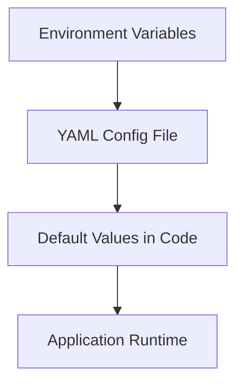

# Configuration Guide 📋

[](../README.md)

## Overview

CardioXNet uses a **layered configuration approach** with clear priority ordering:

1. **Default values** in code (Pydantic models)
2. **YAML configuration file** (`config/config.yaml`)
3. **Environment variables** (highest priority)

<div align="center">



</div>

---

## 📁 Configuration Files

### `config/config.yaml`

**Main configuration file** - copy from `config/config.example.yaml` to get started.

```yaml
# Application Settings
app_name: "CardioXNet"
environment: "development"
debug: true
host: "0.0.0.0"
port: 8000

# NETS Pipeline Configuration
nets:
  fdr_threshold: 0.01
  top_hypotheses_count: 10
  aggregation_strategy: "intersection"
  string_score_threshold: 0.7
```

### `.env`

**Environment-specific variables** - copy from `.env.example` to create your local configuration.

```bash
# Application
NETS_ENVIRONMENT=production
NETS_DEBUG=false

# Pipeline
NETS_FDR_THRESHOLD=0.001
NETS_TOP_HYPOTHESES_COUNT=20
```

---

## ⚙️ Configuration Options

### Application Settings

| Parameter | Type | Default | Description |
|-----------|------|---------|-------------|
| `app_name` | string | `"CardioXNet"` | Application display name |
| `environment` | string | `"development"` | Runtime environment |
| `debug` | boolean | `true` | Enable debug logging |
| `host` | string | `"0.0.0.0"` | Server bind address |
| `port` | integer | `8000` | Server port |
| `log_level` | string | `"INFO"` | Logging verbosity |

### CORS Configuration

| Parameter | Type | Default | Description |
|-----------|------|---------|-------------|
| `cors_origins` | list | `["http://localhost:3000", "http://localhost:8000"]` | Allowed CORS origins |

---

## 🔬 NETS Pipeline Configuration

### API Versions & Endpoints

| Parameter | Type | Default | Description |
|-----------|------|---------|-------------|
| `nets.genemania_version` | string | `"3.5.2"` | GeneMANIA API version |
| `nets.string_version` | string | `"11.5"` | STRING database version |
| `nets.gprofiler_version` | string | `"e104_eg51_p15"` | g:Profiler version |
| `nets.reactome_version` | string | `"79"` | Reactome database version |

### Core Analysis Parameters

| Parameter | Type | Default | Description |
|-----------|------|---------|-------------|
| `nets.genemania_neighbor_count` | integer | `50` | Neighbors per seed gene |
| `nets.string_score_threshold` | float | `0.7` | STRING interaction confidence |
| `nets.fdr_threshold` | float | `0.05` | Pathway enrichment significance |
| `nets.top_hypotheses_count` | integer | `5` | Hypotheses to validate |

### Database Integration Weights

Higher weights prioritize certain pathway databases in NES scoring:

| Database | Parameter | Default | Description |
|----------|-----------|---------|-------------|
| **Reactome** | `nets.db_weight_reactome` | `1.5` | Curated pathways |
| **KEGG** | `nets.db_weight_kegg` | `1.5` | Metabolic pathways |
| **WikiPathways** | `nets.db_weight_wikipathways` | `1.2` | Community pathways |
| **GO:BP** | `nets.db_weight_gobp` | `1.0` | Biological processes |

### Aggregation Strategies

| Parameter | Type | Default | Description |
|-----------|------|---------|-------------|
| `nets.aggregation_strategy` | string | `"intersection"` | How to combine pathways |
| `nets.min_support_threshold` | integer | `2` | Minimum pathway support |

**Available strategies:**
- `"intersection"` - Pathways appearing in ≥ N primaries
- `"frequency"` - Pathways above frequency threshold
- `"weighted"` - Weighted by primary significance

### Enhanced Semantic Filtering

CardioXNet's **revolutionary semantic filtering system** focuses results on cardiac repair and regeneration pathways:

| Parameter | Type | Default | Description |
|-----------|------|---------|-------------|
| `nets.semantic_relevance_threshold` | float | `0.40` | Minimum cardiac relevance score (0.0-1.0) |
| `nets.semantic_repair_boost` | float | `2.0` | Multiplier for repair/regeneration pathways |
| `nets.semantic_max_results` | integer | `100` | Maximum pathways to return |
| `nets.semantic_progressive_thresholds` | object | See below | Progressive filtering tiers |

**Progressive Thresholds Configuration:**
```yaml
semantic_progressive_thresholds:
  high: 0.60    # Strict cardiac repair focus
  medium: 0.45  # Moderate cardiac relevance
  low: 0.30     # Basic cardiac association
```

**Scoring Algorithm:**
- **Repair/Regeneration (60%)**: Cardiac repair, regeneration, healing pathways
- **Cardiac Processes (25%)**: Heart-specific biological processes
- **Direct Cardiac (15%)**: Heart tissue/cell specific pathways
- **Negative Penalty (-50%)**: Non-cardiac or generic pathways

### Literature & Validation

| Parameter | Type | Default | Description |
|-----------|------|---------|-------------|
| `nets.pubmed_max_results` | integer | `100` | Max PubMed results per gene |
| `nets.literature_relevance_threshold` | float | `0.3` | Literature relevance cutoff |

### API Configuration

| Parameter | Type | Default | Description |
|-----------|------|---------|-------------|
| `nets.genemania_api_url` | string | `"https://genemania.org/api"` | GeneMANIA endpoint |
| `nets.string_api_url` | string | `"https://string-db.org/api"` | STRING endpoint |
| `nets.gprofiler_api_url` | string | `"https://biit.cs.ut.ee/gprofiler/api"` | g:Profiler endpoint |
| `nets.reactome_api_url` | string | `"https://reactome.org/ContentService"` | Reactome endpoint |

### Retry & Timeout Settings

| Parameter | Type | Default | Description |
|-----------|------|---------|-------------|
| `nets.max_retries` | integer | `3` | API retry attempts |
| `nets.retry_backoff_factor` | float | `2.0` | Exponential backoff multiplier |
| `nets.request_timeout` | integer | `30` | API request timeout (seconds) |

### Output Configuration

| Parameter | Type | Default | Description |
|-----------|------|---------|-------------|
| `nets.output_formats` | list | `["markdown", "json", "html"]` | Report formats |

---

## 🌍 Environment Variable Overrides

Any YAML parameter can be overridden using environment variables with the `NETS_` prefix:

### Examples

```bash
# Application settings
export NETS_ENVIRONMENT=production
export NETS_DEBUG=false
export NETS_LOG_LEVEL=WARNING

# Pipeline parameters
export NETS_FDR_THRESHOLD=0.01
export NETS_TOP_HYPOTHESES_COUNT=10
export NETS_AGGREGATION_STRATEGY=frequency

# Database weights
export NETS_DB_WEIGHT_REACTOME=2.0
export NETS_DB_WEIGHT_KEGG=1.8

# Semantic Filtering
export NETS_SEMANTIC_RELEVANCE_THRESHOLD=0.40
export NETS_SEMANTIC_REPAIR_BOOST=2.0
export NETS_SEMANTIC_MAX_RESULTS=100
```

### Complete Environment Setup

```bash
# Application
export NETS_ENVIRONMENT=production
export NETS_DEBUG=false
export NETS_HOST=0.0.0.0
export NETS_PORT=8000

# Pipeline Configuration
export NETS_GENEMANIA_NEIGHBOR_COUNT=75
export NETS_STRING_SCORE_THRESHOLD=0.8
export NETS_FDR_THRESHOLD=0.001
export NETS_TOP_HYPOTHESES_COUNT=15
export NETS_AGGREGATION_STRATEGY=weighted
export NETS_MIN_SUPPORT_THRESHOLD=3

# Database Weights
export NETS_DB_WEIGHT_REACTOME=2.0
export NETS_DB_WEIGHT_KEGG=1.8
export NETS_DB_WEIGHT_WIKIPATHWAYS=1.5
export NETS_DB_WEIGHT_GOBP=1.2

# Enhanced Semantic Filtering
export NETS_SEMANTIC_RELEVANCE_THRESHOLD=0.40
export NETS_SEMANTIC_REPAIR_BOOST=2.0
export NETS_SEMANTIC_MAX_RESULTS=100

# Literature Mining
export NETS_PUBMED_MAX_RESULTS=200
export NETS_LITERATURE_RELEVANCE_THRESHOLD=0.4

# API Timeouts
export NETS_MAX_RETRIES=5
export NETS_REQUEST_TIMEOUT=60
```

---

## 📋 Configuration Best Practices

### Development vs Production

#### Development
```yaml
environment: "development"
debug: true
log_level: "DEBUG"

nets:
  genemania_neighbor_count: 25
  fdr_threshold: 0.1
  top_hypotheses_count: 3
```

#### Production
```yaml
environment: "production"
debug: false
log_level: "WARNING"

nets:
  genemania_neighbor_count: 100
  fdr_threshold: 0.001
  top_hypotheses_count: 20
```

### Performance Tuning

#### High-Throughput Analysis
```yaml
nets:
  genemania_neighbor_count: 100
  string_score_threshold: 0.6
  fdr_threshold: 0.01
  top_hypotheses_count: 15
  max_retries: 5
  request_timeout: 60
```

#### Fast Development Testing
```yaml
nets:
  genemania_neighbor_count: 10
  string_score_threshold: 0.7
  fdr_threshold: 0.1
  top_hypotheses_count: 2
  pubmed_max_results: 20
```

#### Memory-Constrained Environments
```yaml
nets:
  genemania_neighbor_count: 30
  top_hypotheses_count: 5
  pubmed_max_results: 50
```

---

## 🔍 Configuration Validation

Configuration is **automatically validated** on startup using Pydantic. Invalid values cause immediate failure with clear error messages.

### Common Validation Errors

| Error | Cause | Solution |
|-------|-------|----------|
| `fdr_threshold > 1.0` | Invalid p-value | Use value between 0.0-1.0 |
| `aggregation_strategy not in [...]` | Invalid strategy | Use `intersection`, `frequency`, or `weighted` |
| `port < 1024` | Privileged port | Use port ≥ 1024 or run as admin |

### Validation Example

```bash
# This will fail validation
export NETS_FDR_THRESHOLD=1.5  # Invalid: must be ≤ 1.0

# Application startup will show:
# ValidationError: nets.fdr_threshold must be less than or equal to 1.0
```

---

## 🐛 Troubleshooting Configuration

### Configuration Not Loading

**Symptoms:** Settings not taking effect

**Solutions:**
1. Check file permissions on `config/config.yaml`
2. Verify YAML syntax with online validator
3. Ensure environment variables are exported
4. Check application logs for parsing errors

### API Connection Issues

**Symptoms:** External API failures

**Solutions:**
```yaml
# Increase timeouts and retries
nets:
  max_retries: 5
  retry_backoff_factor: 2.0
  request_timeout: 60
```

### Performance Issues

**Symptoms:** Analysis too slow

**Solutions:**
```yaml
# Reduce computational load
nets:
  genemania_neighbor_count: 25
  top_hypotheses_count: 5
  pubmed_max_results: 50
```

### Memory Issues

**Symptoms:** Out of memory errors

**Solutions:**
```yaml
# Reduce memory usage
nets:
  genemania_neighbor_count: 20
  top_hypotheses_count: 3
```

---

## 📝 Configuration Examples

### Basic Research Setup
```yaml
app_name: "CardioXNet Research"
environment: "development"
debug: true

nets:
  fdr_threshold: 0.01
  top_hypotheses_count: 10
  aggregation_strategy: "intersection"
  min_support_threshold: 2
```

### High-Confidence Analysis
```yaml
nets:
  fdr_threshold: 0.001
  string_score_threshold: 0.8
  aggregation_strategy: "weighted"
  min_support_threshold: 3
  db_weight_reactome: 2.0
  db_weight_kegg: 1.8
```

### Literature-Heavy Analysis
```yaml
nets:
  top_hypotheses_count: 20
  pubmed_max_results: 200
  literature_relevance_threshold: 0.4
  max_retries: 5
```

---

## 🔗 Related Documentation

- **[README.md](../README.md)** - Main project documentation
- **[QUICK_START_GUIDE.md](../QUICK_START_GUIDE.md)** - Step-by-step setup
- **[WORKFLOW_DESCRIPTION.md](../WORKFLOW_DESCRIPTION.md)** - Pipeline stages explained
- **[API Documentation](http://localhost:8000/docs)** - Interactive API docs

---

<div align="center">

**Need help?** [Open an issue](https://github.com/yourusername/cardioxnet/issues) or check the [troubleshooting guide](../README.md#troubleshooting)

</div>
